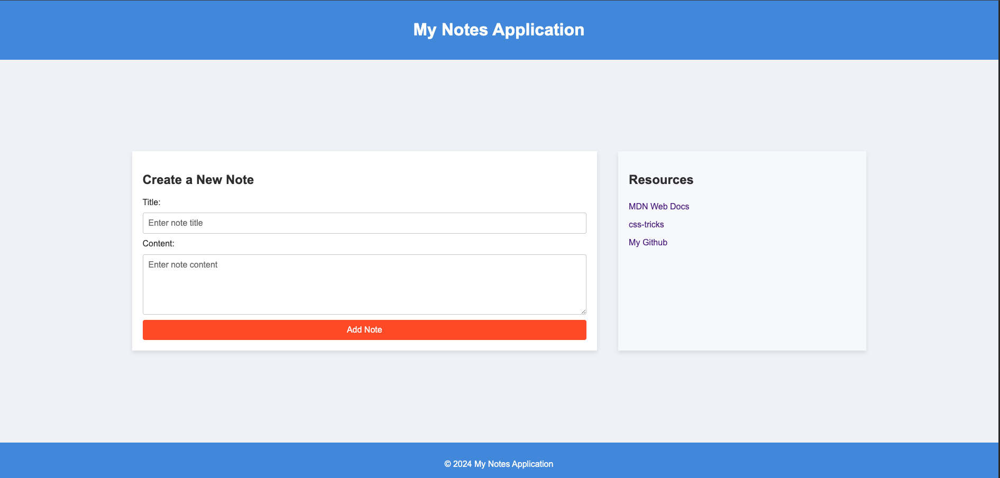

### CHALLENGE.md

# Introduction

Welcome to the **HTML Semantics and CSS Foundations** challenge!

In this exercise, you will learn to apply semantic HTML and basic CSS design principles to create a simple web interface. Additionally, you will be introduced to fundamental concepts of **Source Version Control** using Git and GitHub and **Continuous Integration/Continuous Deployment (CI/CD)** using Netlify.

This challenge is designed for you to practice core web development concepts while also getting hands-on experience with industry-standard tools.

By the end of this challenge, you will have:

- Created a basic HTML/CSS layout following semantic best practices.
- Set up a Git repository to manage your source code.
- Deployed your project on Netlify to make it publicly accessible.

# Source Version Control

### Git and GitHub Setup

To begin the challenge, you'll create a new repository based on a template repository. Follow the steps below to set up your Git and GitHub environment:

1. **Create a New Repository from the Template**:

   - Go to the [00_semantic-html-css template repository](https://github.com/DAW-Escola-Pia-Mataro-Client-24-25/00_semantic-html-css).
   - Click the green **"Use this template"** button at the top of the page.
   - In the **"Create a new repository"** page:
     - Set the repository name as `00_semantic-html-css`.
     - Choose visibility as _Public_.
     - Click **"Create repository from template"** to generate a new repository in your GitHub account.

2. **Clone the New Repository to Your Local Machine**:

   - Open a terminal on your local machine and clone the newly created repository:

   ```bash
   git clone https://github.com/<YOUR-USERNAME>/00_semantic-html-css.git
   ```

   - Replace `<YOUR-USERNAME>` with your GitHub username.

3. **Navigate to the Project Directory**:

   - Move into the cloned repository’s directory:

   ```bash
   cd 00_semantic-html-css
   ```

4. **Create a New `develop` Branch**:

   - Inside the repository, create a new branch called `develop` to work on the challenge:

   ```bash
   git checkout -b develop
   ```

5. **Work on the Challenge**:

   - Modify the `index.html`, `style.css`, and `sanitize.css` files as required by the challenge.
   - As you make progress, add and commit your changes:

   ```bash
   git add .
   git commit -m "Initial implementation of the challenge"
   ```

6. **Push Changes to GitHub**:

   - Push your local `develop` branch to your GitHub repository:

   ```bash
   git push origin develop
   ```

7. **Create a Pull Request**:

   - Once your changes are committed and pushed to the `develop` branch, open your repository on GitHub.
   - Click on the "Compare & pull request" button.
   - Ensure that the pull request (PR) is set to merge `develop` into `main`.
   - Add a description of your work and submit the PR.

8. **Review and Merge the Pull Request**:
   - Review the changes made in the `develop` branch, and if everything looks good, merge the pull request into `main`.
   - All changes should be made on the `develop` branch and merged into `main` via a pull request to maintain version control best practices.

Following these steps ensures an organized workflow while working on the challenge using Git and GitHub, as well as proper branching strategies.

> [!WARNING]  
> Pull Request can be only merged under teacher approve.

# Challenge

### Requirements

In this challenge, you will recreate the HTML and CSS interface.



Follow the steps below to complete your task:

1. **Create `index.html` File**:

   - In the `00_semantic-html-css` folder, create an `index.html` file.
   - The `index.html` file must contain semantic HTML..
   - Include a form in the main section, as demonstrated in the previous example, and include appropriate semantic tags.

2. **Create `style.css` File**:

   - Create a `style.css` file in the same directory.
   - The CSS should style your HTML page based on the previous example:
     - Ensure that the content is centered.
     - Set a 100% wide header.
     - Place sections as described (side-by-side).
     - Use a simple chromatic palette for design:
       - header & footer bg color: #4a90e2;
       - main bg color: #f0f4f8;
       - main text color: #333;
       - containers bg color: #ffffff; (form and resources)
       - button bg color: #ff5722;
       - button hover color: #e64a19;

3. **Create `sanitize.css` File**:

   - Create a `sanitize.css` file, based on the provided example.
   - This file will help normalize styling across different browsers.

4. **Ensure Functionality**:

   - The final interface must look as close as possible to the example provided earlier. Ensure that the layout and form elements are properly styled and functional.

5. **Test Your HTML/CSS**:
   - Open the `index.html` file in your browser to check if everything is displayed correctly.

# CI/CD

### Deploy the Project Using Netlify

Now that your project is ready, it's time to deploy it online using **Netlify**. Follow these steps:

1. **Create a Netlify Account**:

   - If you don't have a Netlify account, sign up for one at [https://www.netlify.com](https://www.netlify.com).

2. **Link GitHub Repository to Netlify**:

   - In the Netlify dashboard, click on **Add New Site** and choose **Import an existing project**.
   - Select **GitHub** as the source and authenticate your GitHub account.
   - Find and select your `00_semantic-html-css` repository.

3. **Configure Deployment Settings**:

   - In the build settings, you can leave the default values as Netlify will auto-detect this as a static site.
   - No additional build command is needed for this simple project.

4. **Deploy the Site**:

   - Click on **Deploy Site**.
   - After the deployment process completes, your site will be live with a Netlify-provided URL.

5. **Customizing the URL (Optional)**:
   - You can change the default Netlify subdomain to a custom one by going to the **Domain Settings** in your Netlify dashboard.

# Generative AI

### Using AI Assistance

During the challenge, you can use Generative AI tools, including this assistant, to help with the challenge. Feel free to:

- Request explanations of any piece of code.
- Ask for clarifications on HTML, CSS, Git, or Netlify deployment steps.

AI should be used to enhance your learning, so while it can generate code or explain concepts, ensure you understand the processes to fully benefit from the challenge.

Good luck! 🚀
